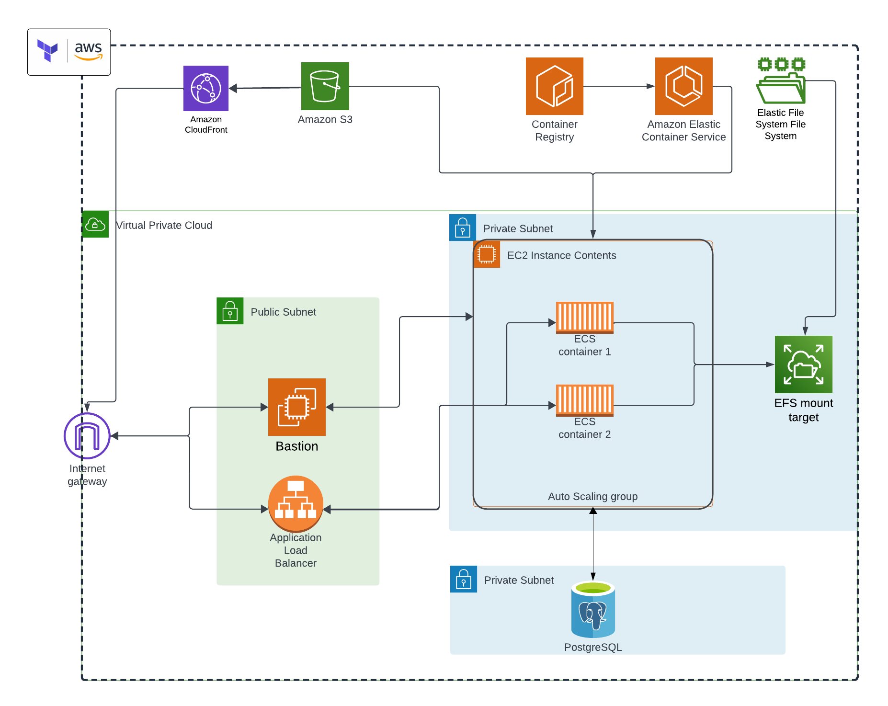

# AWS template to practice Infastructure as Code with Terrafrom

This template is designed for self-practice with Infrastructure as Code (IaC) using Terraform on AWS. The project sets up a comprehensive AWS environment, including a Virtual Private Cloud (VPC), Elastic File System (EFS), Bastion host, Auto Scaling Group (ASG), S3 buckets, RDS Postgres database, Elastic Container Registry (ECR), and Elastic Container Service (ECS).

## Project cloud architecture


## Prerequirements

- An AWS IAM credentials with configured `administrator access permission`.
- Configured AWS profile name and default region in `~/aws/credentials` and `~/.aws/config`


## Basic Terraform commands
```bash
# Initialize Terraform in the current directory
$ terraform init

# Create an execution plan
$ terraform plan

# Apply the changes to create or update infrastructure
$ terraform apply

# Apply the changes to create or update infrastructure with auto approve
$ terraform apply -auto-approve

# Destroy the created infrastructure
$ terraform destroy

# Destroy the created infrastructure with auto approve
$ terraform destroy -auto-approve

# dump output to a file
$ terraform output > output.txt
```
